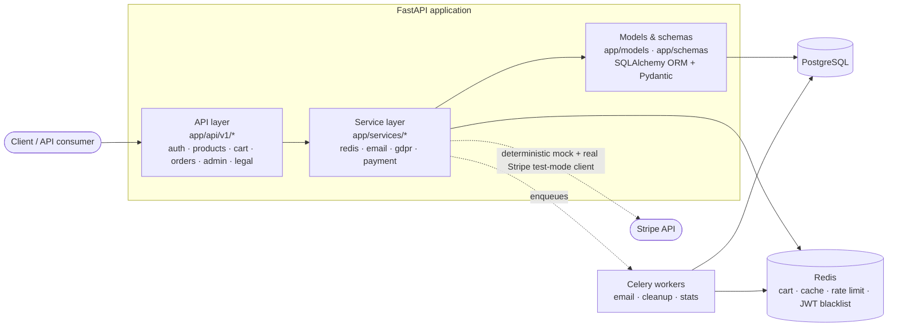

# FastAPI E-commerce Backend

[](https://github.com/nadeko0/fastapi_e-commerce_backend/actions/workflows/ci.yml)


[](LICENSE)

A domain-neutral e-commerce backend API built with FastAPI, SQLAlchemy, and
PostgreSQL. It's meant to be a **foundation** to build a real store on top of
(clothing, electronics, whatever the product actually is), not a finished
demo — the catalog, orders, and payment layer are deliberately not tied to
any one kind of product. Backend-only; there is no frontend and none is
planned.

Auth, order/inventory concurrency, and the payment layer have all been
through a dedicated adversarial testing pass (rate-limit bypass, token
fixation, race conditions on the last unit of stock and on concurrent cart
updates, payment amount/currency fuzzing) and a real-infrastructure pass
(load testing against a real Postgres/Redis/Celery deployment, a live run
against Stripe's actual test-mode API) that found and fixed genuine
concurrency bugs rather than leaving them as theoretical.

## Architecture



## Features

**Users & auth** — JWT access tokens plus a rotating refresh-token flow
(`POST /users/refresh`): each refresh both issues a new access/refresh pair
and invalidates the one it consumed, with reuse of an already-rotated token
treated as a theft signal that revokes the whole token family. Role-based
access (client/admin), email verification, password reset with token
invalidation on reset (fixes token fixation), Redis-backed token blacklist
on logout, sliding-window rate limiting (stricter limits on login/register).

**Catalog** — products with a `characteristics` JSON attribute bag, nested
categories (arbitrary depth, verified), `ProductVariant`s (SKU, free-form
attributes like size/color, price override, own stock) fully wired into cart
and checkout — a variant line prices and decrements stock independently from
its parent product, a product without variants still works exactly as a
simple product — Redis caching for the category tree and hot products.

**Cart & orders** — Redis-backed cart with atomic (WATCH/MULTI) add/update/
remove, so concurrent requests for the same line can't lose an update;
idempotency-key checkout (a retried request returns the original order
instead of creating a duplicate); an atomic `UPDATE ... WHERE stock >=
quantity` stock decrement, applied identically to plain products and
variants (no oversell under concurrent checkout for the last unit); an
explicit order status state machine; and stock restoration on cancellation.

**Payments** — a `PaymentProvider` abstraction with two implementations: a
deterministic `StripePaymentProvider` mock (default, used by the main test
suite — no network call, fast) and a `LiveStripePaymentProvider` that calls
the real Stripe SDK against Stripe's test-mode API, exercised by dedicated
opt-in test suites (`tests/integration/test_payment_live_stripe.py`,
`tests/integration/test_checkout_session_live_stripe.py`) covering
successful/declined/3-D-Secure-required cards, refunds, idempotency, and
real webhook signature verification. Two payment flows sit behind the same
contract: `POST /orders/{id}/pay` confirms a PaymentIntent server-side with
a client-collected payment method token, and `POST
/orders/{id}/checkout-session` creates a Stripe-hosted Checkout Session —
the customer is redirected to Stripe's own page for card entry/3DS, and the
result comes back asynchronously via webhook (`checkout.session.completed`
and friends), so this backend never handles card data for that flow at all.
Both flows: idempotent intent/session creation, idempotent webhook
processing, 3D Secure (`requires_action`) as a distinct state, and
amount/currency validation (property-tested with `hypothesis`).

**Email** — an `EmailProvider` abstraction (`app/services/email/`) mirroring
the payment layer's shape: `SmtpEmailProvider` (real smtplib, bounded
`SMTP_TIMEOUT_SECONDS` connect/send timeout) and `LoggingEmailProvider`
(no-op, used by tests/local dev), selected via `EMAIL_PROVIDER`. Verified
against a real SMTP server (Ethereal), not just mocked — see the bug log
below for what that caught.

**GDPR** — consent tracking with a full audit trail (type, timestamp, IP,
user agent), data export (Art. 15/20), and erasure (Art. 17) that anonymizes
the account in place rather than hard-deleting it, so order/invoice history
required for tax-law retention survives with personal identifiers scrubbed.
Full technical breakdown in [GDPR / Data Protection](#gdpr--data-protection).

**Ops** — structured JSON logging, a `/health` endpoint checking DB/Redis
reachability, graceful shutdown via uvicorn's own signal handling, and a
demo-data seed script (`scripts/seed_demo_data.py`) to get a populated
catalog running in minutes.

## Tech stack

| | |
|---|---|
| Runtime | Python 3.13 |
| Framework | FastAPI 0.141.1 (Starlette 1.6.0) |
| Database | PostgreSQL, SQLAlchemy 2.0.52, Alembic migrations |
| Cache / queue broker | Redis 8.1.0 |
| Background jobs | Celery 5.6.3 |
| Auth | JWT (python-jose 3.5.0), bcrypt 5.0.0 (called directly, no passlib) |
| Packaging | [uv](https://docs.astral.sh/uv/) (`pyproject.toml` + `uv.lock`) |
| Testing | pytest, pytest-cov, hypothesis, fakeredis |

Dependency versions are chosen deliberately, not just bumped to latest:
`python-jose` 3.5.0 fixes CVE-2024-33663 (algorithm confusion); FastAPI jumped
from the 0.115.x line straight to 0.141.x specifically to pull in a Starlette
release patched against CVE-2025-62727 (a `Range`-header DoS) that FastAPI
0.115.x's older Starlette pin can't take alone; `passlib` (unmaintained since
2020) breaks outright on bcrypt ≥5 — rather than pin bcrypt back, `app/core/security.py`
calls `bcrypt.hashpw`/`bcrypt.checkpw` directly and passlib was dropped.

## Quick start

```bash
git clone https://github.com/nadeko0/fastapi_e-commerce_backend.git
cd fastapi_e-commerce_backend
cp .env.example .env        # edit with your local DB/Redis/SMTP settings
uv sync                     # creates .venv, installs pinned deps from uv.lock
uv run alembic upgrade head
uv run python scripts/seed_demo_data.py   # optional: populated demo catalog + admin user
uv run python main.py       # or: uv run uvicorn app.main:app --reload
```

API docs at `http://localhost:8000/api/v1/docs` (Swagger) or `/redoc`.
Run the test suite with `uv run pytest --cov=app`. See [SETUP.md](SETUP.md)
for the full walkthrough (Postgres/Redis setup, migrations, the Postgres-only
smoke test in `scripts/pg_smoke_test.py`, Docker).

## Docker

```bash
docker compose up --build -d
docker compose exec api alembic upgrade head
docker compose exec api python scripts/seed_demo_data.py   # optional
```

[`Dockerfile`](Dockerfile) and [`docker-compose.yml`](docker-compose.yml) are
the source of truth — they build the image with `uv` (deps resolved from
`uv.lock`, not re-resolved at build time) and run five services: `api`,
`db` (Postgres), `redis`, `celery-worker`, and `celery-beat` (the periodic
scheduler for `cleanup_expired_carts`/`cleanup_inactive_accounts`/
`update_product_stats`/`check_low_stock`). This isn't just built locally —
it's been deployed to a real server (isolated `docker compose -p`,
localhost-only ports, torn down after) and exercised for real: migrations,
the seed script, a real Celery worker authenticating to password-protected
Redis and actually consuming and completing queued tasks (confirmed via its
own logs, not assumed), and a load test hitting the live containers — see
[Verified against real infrastructure](#verified-against-real-infrastructure)
for what that found and fixed. Two port settings matter and are
intentionally separate — `PORT` in `.env` is the port uvicorn binds to
*inside* the container (must stay `8000`, matching the Dockerfile's
`HEALTHCHECK`); `DOCKER_API_PORT` is the host-published port, change that
one if `8000` is already taken on your host.

## Project structure

```
app/
├── api/v1/          # Routers: users, products, cart, orders, admin, legal
├── core/            # Settings, DB session, JWT/password logic, rate limiter
├── models/          # SQLAlchemy ORM models
├── schemas/         # Pydantic request/response schemas
├── services/        # Redis, email, GDPR, payment (Stripe abstraction)
├── tasks.py         # Celery tasks (email sending, cleanup, stats)
└── main.py          # FastAPI app, middleware, /health
migrations/          # Alembic migrations (tracked in git)
scripts/             # seed_demo_data.py, pg_smoke_test.py
tests/                # unit/ + integration/, pytest + fakeredis + hypothesis
```

## GDPR / Data Protection

This is a portfolio project, not a legal audit — full regulatory compliance
depends on organizational measures outside a codebase (a real DPA, an actual
DPO, verified breach-response procedures) as well as the code. What's
implemented here targets the technical requirements of EU GDPR
(Regulation (EU) 2016/679) that apply to an e-commerce backend:

- **Lawful basis & consent (Art. 6, 7)** — registration requires explicit
  GDPR consent and privacy-policy acceptance; marketing consent is separate
  and optional. GDPR consent can't be "withdrawn" via the consent endpoint
  (only removed by requesting account deletion, per Art. 6(1)(b) — it's
  needed to fulfil the contract); marketing consent toggles freely either
  way, matching Art. 7(3)'s "as easy to withdraw as to give."
- **Consent audit trail (Art. 7(1))** — every consent-affecting action
  (registration, consent updates) appends a `{type, granted, timestamp,
  ip_address, user_agent}` record to `consent_history`, in one consistent
  shape across both places consent can be changed.
- **Right of access & portability (Art. 15, 20)** — `GET /users/data/export`
  returns personal data, consent history, addresses, and orders as
  structured JSON.
- **Right to erasure (Art. 17)** — `POST /users/data/delete` deactivates the
  account immediately; a scheduled task anonymizes the account (email,
  name, phone, addresses) after a 1-day grace period
  (`DATA_DELETION_GRACE_PERIOD_DAYS`). Order/invoice rows are **not**
  deleted — Art. 17(3)(b) exempts data still needed for a legal obligation,
  and most EU member states require invoices retained for tax purposes for
  around 10 years, so financial records survive with their personal
  identifiers scrubbed rather than being cascade-deleted with the account.
- **Data minimization (Art. 5(1)(c))** — no collection beyond what
  registration/checkout/delivery actually need.

Deliberately not built: automatic deletion purely on retention-period expiry
(only explicit erasure requests are acted on), Art. 18 restriction-of-processing
as a distinct state, a separate Art. 21 objection endpoint (the one
unconditional objection right, Art. 21(2), is already served by the
marketing-consent toggle), Art. 30 records-of-processing and Art. 33/34
breach notification (both organizational/process documents, not app
features), and field-level envelope encryption for crypto-shredding PII (the
anonymize-in-place approach above reaches the same legal outcome without a
KMS dependency).

## How this compares to mature commerce platforms

Checked the architecture here against [Saleor](https://docs.saleor.io/),
[Medusa](https://docs.medusajs.com/), and [Vendure](https://docs.vendure.io/)
(docs/public source only — nothing cloned or copied, comparisons written
from scratch):

- **Product/variant modeling.** Saleor and Medusa both split "product"
  (template) from "variant" (purchasable SKU with its own price/stock).
  `ProductVariant` here follows the same idea, added as a purely additive
  extension — a product without variants still behaves exactly like a
  simple product — and is fully wired into cart and checkout: a variant
  line prices and decrements stock independently, with the same atomic
  `UPDATE ... WHERE stock >= quantity` guard used for plain products.
- **Order state.** Vendure formalizes order/payment transitions as an
  explicit pluggable FSM; Saleor separates whole-order status from a
  per-fulfillment status (since one order can ship in several parts). This
  project fulfills an order as a single unit, so one `OrderStatus` enum plus
  a hardcoded adjacency check is a proportionate substitute — it would need
  to grow toward Vendure's approach only if partial fulfillment became a
  real requirement.
- **Payment layering.** `app/services/payment/`'s `PaymentProvider`
  abstraction (rather than calling a payment SDK directly from route
  handlers) matches how Saleor and Vendure isolate payment gateways so a
  second provider could be added without touching order logic. Both a
  deterministic mock and a real Stripe-backed implementation sit behind the
  same abstraction; the live one has been exercised against Stripe's actual
  test-mode API (successful/declined/3-D-Secure cards, refunds, idempotency,
  webhook signatures) — see `tests/integration/test_payment_live_stripe.py`.

## Verified against real infrastructure

Most of what's listed above was validated by the test suite, which is
useful but stops at the boundary of what a mock can catch. On top of that,
this project was deployed to a real server (Docker Compose: Postgres,
Redis, the API, a Celery worker, Celery beat) and to a real local machine
(native Postgres + Redis, no Docker), then put under an actual `locust`
load test (up to 200 concurrent simulated users) and a real Stripe
test-mode account — specifically to catch the class of bug that only shows
up under real concurrency, real I/O latency, and a real payment provider's
actual API contract, not the idealized one a mock implements. It found six
genuine bugs, all fixed and covered by a regression test:

1. **Celery's Redis broker had no password.** `docker-compose.yml`'s
   `redis` service runs `--requirepass`, but `app/tasks.py` built its broker
   URL as `redis://host:port/db` with no auth — a real worker would fail to
   connect entirely. Fixed by extracting URL construction into a tested
   `build_redis_broker_url()` that includes the password when one's set.
2. **`bcrypt` blocked the event loop under load.** `verify_password`/
   `get_password_hash` are CPU-bound (bcrypt is deliberately slow) and were
   called directly inside `async def` route handlers — under concurrent
   auth traffic, one request's hash blocked *every* request on that uvicorn
   worker, including unrelated ones. Measured impact: 100 concurrent users,
   2 workers → ~15s median login latency, with `GET /products` degraded to
   ~5.6s purely from being queued behind blocked event loops. Fixed by
   offloading to a threadpool (`run_in_threadpool`) with a bounded
   semaphore (sized to CPU count) so unbounded concurrent hashing can't
   pile up and starve other resources.
3. **That fix, in turn, caused a real Postgres connection-pool leak.**
   `login()`/`reset_password()` queried the user (checking out a DB
   connection, opening an implicit transaction) and then `await`ed the
   now-threadpooled bcrypt call while still holding it. Under load this
   inflated connection hold-time, and — confirmed by directly instrumenting
   FastAPI's dependency-cleanup machinery — a cancelled request could skip
   `session.close()` entirely (anyio's cancellation is scope-sticky: once
   cancelled, cleanup code in the same scope never runs), permanently
   leaking the connection as `idle in transaction`. Reproduced live: a
   locust burst left 30-60 Postgres connections wedged, unrecoverable
   without restarting the process. Fixed two ways: (a) release the session
   *before* the bcrypt await in every affected handler, and (b) defense in
   depth — Postgres itself now kills any connection idle-in-transaction
   for >30s (`idle_in_transaction_session_timeout`) and SQLAlchemy's
   `pool_pre_ping` transparently discards it on next checkout, so even an
   unknown future variant of this bug self-heals instead of wedging the
   pool permanently. **Found again, separately, for Celery**: `app/tasks.py`
   has its own DB engine (a different process from the API), which had
   none of this protection — a real worker run left 2 connections stuck
   idle-in-transaction for 38+ minutes. Fixed by having it reuse the same
   `_build_connect_args`/pool settings instead of a bare `create_engine(...)`.
4. **Stripe's `PaymentIntent.confirm` needs `return_url`.** Confirmed the
   hard way — a real notice from Stripe's own fraud/reliability monitoring,
   received after the 3-D-Secure test ran without one. Pinning
   `payment_method_types=["card"]` at creation avoids Stripe's *Dashboard
   redirect-payment-method* return_url requirement, but a card's own 3DS
   challenge is a redirect regardless, and still needs one at confirm time.
   Fixed by always passing a `return_url`; the checkout-session flow sets
   `success_url`/`cancel_url` for the same underlying reason.
5. **`smtplib.SMTP(host, port)` had no timeout.** Reproduced live against a
   real SMTP server (Ethereal): the send call hung indefinitely — with an
   explicit `timeout=10` the identical email sent in under a second. Since
   this runs from background tasks and Celery jobs, an unresponsive/slow
   mail server could quietly exhaust worker threads. Fixed with a new
   `SMTP_TIMEOUT_SECONDS` setting (default 10s), with a regression test
   asserting the connection is always opened with an explicit timeout.
6. **A deliberate 404 could get swallowed into a 500.**
   `update_current_user` raised `HTTPException(404, ...)` inside a `try`
   whose `except Exception` caught it too (`HTTPException` *is* an
   `Exception`) and rewrote it to a generic 500 — misleading client retry
   logic (500 implies retryable, 404 doesn't) and hiding the real cause.
   Found by a dedicated read-only audit of the whole API surface for
   status/body mismatches (the kind of bug a frontend checking only the
   HTTP status code, not the body, would never notice). The same audit
   found `app/api/v1/legal.py` was the only router not using the common
   `APIResponse` envelope every other endpoint uses — fixed both.

Also verified, not just claimed: a real Celery worker authenticating to
password-protected Redis and consuming/completing real queued tasks
(confirmed via its own logs — `Task update_product_stats[...] received` /
`succeeded`, not inferred); Celery beat's periodic schedule; the atomic
cart path holding up under concurrent add/remove/update from many users
sharing a small product catalog with zero lost updates; and the
`idle_in_transaction_session_timeout` fix specifically re-verified by
querying `pg_stat_activity` mid- and post-load-test on the real deployment.

## Independent re-verification (round 3)

Everything above had already been through two review passes. This pass
existed specifically to stop trusting that on its own: a full line-by-line
read of every file in `app/` (not diffs — each file read whole, as a
stranger's PR), including the code that had accumulated as a side effect of
earlier bug fixes (the bcrypt semaphore, `_build_connect_args`,
`build_redis_broker_url`, the live-Stripe `return_url` handling,
`SMTP_TIMEOUT_SECONDS`, the `APIResponse` wrapper) and had never itself been
independently reviewed. It found and fixed 20 more genuine bugs, each with a
regression test — none of them the same class as the six below, since those
were checked most carefully already:

- **Idempotency gaps**: `POST /orders/{id}/refund` had no `Idempotency-Key`
  handling at all (unlike `/pay` and `/checkout-session`) and its own local
  bookkeeping could double-apply a replayed refund even with the provider
  itself deduped; Celery's `send_order_confirmation`/`send_order_status_update`
  had no redelivery guard, so Celery's at-least-once delivery could send a
  customer the same order email twice.
- **Security-relevant gaps**: the Redis broker password in
  `build_redis_broker_url` wasn't percent-encoded, so a password containing
  `@`, `:`, `/`, `#`, or `%` could corrupt or truncate the broker URL;
  `CheckoutSessionCreate.success_url`/`cancel_url` had no scheme validation
  (potential open redirect via a non-http(s) URL); `send_welcome_email`
  interpolated the attacker-controlled `full_name` into HTML unescaped.
- **Correctness bugs surfaced by the "check every occurrence of a known
  pattern" pass**: `GET /products?sort_by=created_at_desc` 500'd (a
  `"..._desc".split('_')` that should have been `rsplit('_', 1)` — the same
  pattern `admin.py` already had right); concurrent duplicate product-variant
  SKUs raised an uncaught `IntegrityError` (500) instead of the 409 the
  sequential case already returned; `RedisService` only caught
  `ConnectionError`, not the broader `RedisError`, so a Redis *timeout*
  (rather than a dropped connection) bypassed the documented fail-open
  contract on all 23 methods; SQLAlchemy `Column(default=[])`/`default={}`
  on three models shared one mutable object across every row that didn't set
  the column explicitly.
- **Quality/consistency**: `app/schemas/legal.py` was still on Pydantic v1
  config keys (`schema_extra`, `orm_mode`), silently dropped by Pydantic v2 —
  every documented OpenAPI example in that module was dead; `redis.py` used
  `print()` instead of the app logger for error paths.

Full per-finding detail (file:line, fix, test) lived in this session's
working notes; the summary above is what's durable enough to keep here.

**What this session could and couldn't re-verify independently:**

- **Docker build/run** — previously untested by any prior session (no Docker
  available). This time, built and ran the full `docker compose` stack
  (`api`, `db`, `redis`, `celery-worker`, `celery-beat`) on a real remote
  server, in an isolated project namespace and network with non-default
  ports so it couldn't collide with that server's other unrelated running
  containers, ran `alembic upgrade head` against it, confirmed `/health`
  returns 200 and `/api/v1/products` serves real data, then tore the whole
  thing down (containers, images, volumes, network) and confirmed nothing
  else on that server was touched. Docker is confirmed working, not just
  claimed.
- **Locust sanity check** — the original 200-concurrent-user run's VPS is
  gone and wasn't reproduced at that scale. Instead, ran a short local load
  test (20 users, 60s) against a locally running instance backed by a real
  Postgres/Redis, specifically to confirm the earlier fixes still hold under
  *some* concurrency: login past the rate limit correctly returned `429`
  (not `500`), `/products` stayed responsive throughout. This is a sanity
  check, not a repeat of the original benchmark.
- **Ethereal email delivery and the Stripe `return_url` webhook fix** — not
  re-run this session (no Ethereal/Stripe test credentials available here).
  These remain as reported by the session that originally ran them, not
  independently reconfirmed in round 3.

Test suite: 410 passed, 0 failed, 91.13% coverage, `ruff check` clean,
`alembic check` reports no schema drift against a live Postgres.

## Contributing

1. Fork the repository
2. Create a feature branch
3. Commit your changes
4. Push to the branch
5. Open a Pull Request

## License

MIT — see [LICENSE](LICENSE).
