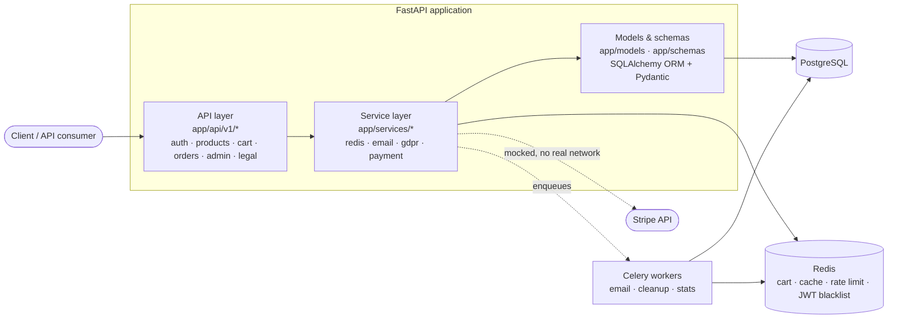

# FastAPI E-commerce Backend

[](https://github.com/nadeko0/fastapi_e-commerce_backend/actions/workflows/ci.yml)


[](LICENSE)

A domain-neutral e-commerce backend API built with FastAPI, SQLAlchemy, and
PostgreSQL. It's meant to be a **foundation** to build a real store on top of
(clothing, electronics, whatever the product actually is), not a finished
demo — the catalog, orders, and payment layer are deliberately not tied to
any one kind of product. Backend-only; there is no frontend and none is
planned.

Auth, order/inventory concurrency, and the payment layer have all been
through a dedicated adversarial testing pass (rate-limit bypass, token
fixation, race conditions on the last unit of stock, payment amount/currency
fuzzing) — see [Known limitations](#known-limitations) for what that pass
found and left as documented, not silently ignored.

## Architecture



## Features

**Users & auth** — JWT access/refresh tokens, role-based access (client/admin),
email verification, password reset with token invalidation on reset (fixes
token fixation), Redis-backed token blacklist on logout, sliding-window rate
limiting (stricter limits on login/register).

**Catalog** — products with a `characteristics` JSON attribute bag, nested
categories (arbitrary depth, verified), optional `ProductVariant`s (SKU,
free-form attributes like size/color, price override, own stock — additive,
a product without variants still works exactly as a simple product; see
[Known limitations](#known-limitations) for what's not wired up yet), Redis
caching for the category tree and hot products.

**Cart & orders** — Redis-backed cart, idempotency-key checkout (a retried
request returns the original order instead of creating a duplicate), an
atomic `UPDATE ... WHERE stock >= quantity` stock decrement (no oversell
under concurrent checkout for the last unit), an explicit order status state
machine, and stock restoration on cancellation.

**Payments** — a `PaymentProvider` abstraction with a `StripePaymentProvider`
implementation shaped like the real Stripe SDK (Payment Intents, refunds,
webhook signature verification) but fully mocked — no real Stripe account
exists for this project and no outbound network call is ever made. Covers
idempotent intent creation, idempotent webhook processing, 3D Secure
(`requires_action`) as a distinct state, and amount/currency validation
(property-tested with `hypothesis`).

**GDPR** — consent tracking with a full audit trail (type, timestamp, IP,
user agent), data export (Art. 15/20), and erasure (Art. 17) that anonymizes
the account in place rather than hard-deleting it, so order/invoice history
required for tax-law retention survives with personal identifiers scrubbed.
Full technical breakdown in [GDPR / Data Protection](#gdpr--data-protection).

**Ops** — structured JSON logging, a `/health` endpoint checking DB/Redis
reachability, graceful shutdown via uvicorn's own signal handling, and a
demo-data seed script (`scripts/seed_demo_data.py`) to get a populated
catalog running in minutes.

## Tech stack

| | |
|---|---|
| Runtime | Python 3.13 |
| Framework | FastAPI 0.141.1 (Starlette 1.6.0) |
| Database | PostgreSQL, SQLAlchemy 2.0.52, Alembic migrations |
| Cache / queue broker | Redis 8.1.0 |
| Background jobs | Celery 5.6.3 |
| Auth | JWT (python-jose 3.5.0), bcrypt 5.0.0 (called directly, no passlib) |
| Packaging | [uv](https://docs.astral.sh/uv/) (`pyproject.toml` + `uv.lock`) |
| Testing | pytest, pytest-cov, hypothesis, fakeredis |

Dependency versions are chosen deliberately, not just bumped to latest:
`python-jose` 3.5.0 fixes CVE-2024-33663 (algorithm confusion); FastAPI jumped
from the 0.115.x line straight to 0.141.x specifically to pull in a Starlette
release patched against CVE-2025-62727 (a `Range`-header DoS) that FastAPI
0.115.x's older Starlette pin can't take alone; `passlib` (unmaintained since
2020) breaks outright on bcrypt ≥5 — rather than pin bcrypt back, `app/core/security.py`
calls `bcrypt.hashpw`/`bcrypt.checkpw` directly and passlib was dropped.

## Quick start

```bash
git clone https://github.com/nadeko0/fastapi_e-commerce_backend.git
cd fastapi_e-commerce_backend
cp .env.example .env        # edit with your local DB/Redis/SMTP settings
uv sync                     # creates .venv, installs pinned deps from uv.lock
uv run alembic upgrade head
uv run python scripts/seed_demo_data.py   # optional: populated demo catalog + admin user
uv run python main.py       # or: uv run uvicorn app.main:app --reload
```

API docs at `http://localhost:8000/api/v1/docs` (Swagger) or `/redoc`.
Run the test suite with `uv run pytest --cov=app`. See [SETUP.md](SETUP.md)
for the full walkthrough (Postgres/Redis setup, migrations, the Postgres-only
smoke test in `scripts/pg_smoke_test.py`, Docker).

## Docker

```bash
docker compose up --build -d
docker compose exec api alembic upgrade head
docker compose exec api python scripts/seed_demo_data.py   # optional
```

[`Dockerfile`](Dockerfile) and [`docker-compose.yml`](docker-compose.yml) are
the source of truth — they build the image with `uv` (deps resolved from
`uv.lock`, not re-resolved at build time) and run Postgres + Redis alongside
the API. This has been deployed and smoke-tested against a real server, not
just built locally: healthy startup, migrations, the seed script, and a full
login-and-fetch-products round trip all verified end to end. Two port
settings matter and are intentionally separate — `PORT` in `.env` is the
port uvicorn binds to *inside* the container (must stay `8000`, matching the
Dockerfile's `HEALTHCHECK`); `DOCKER_API_PORT` is the host-published port,
change that one if `8000` is already taken on your host.

## Project structure

```
app/
├── api/v1/          # Routers: users, products, cart, orders, admin, legal
├── core/            # Settings, DB session, JWT/password logic, rate limiter
├── models/          # SQLAlchemy ORM models
├── schemas/         # Pydantic request/response schemas
├── services/        # Redis, email, GDPR, payment (Stripe abstraction)
├── tasks.py         # Celery tasks (email sending, cleanup, stats)
└── main.py          # FastAPI app, middleware, /health
migrations/          # Alembic migrations (tracked in git)
scripts/             # seed_demo_data.py, pg_smoke_test.py
tests/                # unit/ + integration/, pytest + fakeredis + hypothesis
```

## GDPR / Data Protection

This is a portfolio project, not a legal audit — full regulatory compliance
depends on organizational measures outside a codebase (a real DPA, an actual
DPO, verified breach-response procedures) as well as the code. What's
implemented here targets the technical requirements of EU GDPR
(Regulation (EU) 2016/679) that apply to an e-commerce backend:

- **Lawful basis & consent (Art. 6, 7)** — registration requires explicit
  GDPR consent and privacy-policy acceptance; marketing consent is separate
  and optional. GDPR consent can't be "withdrawn" via the consent endpoint
  (only removed by requesting account deletion, per Art. 6(1)(b) — it's
  needed to fulfil the contract); marketing consent toggles freely either
  way, matching Art. 7(3)'s "as easy to withdraw as to give."
- **Consent audit trail (Art. 7(1))** — every consent-affecting action
  (registration, consent updates) appends a `{type, granted, timestamp,
  ip_address, user_agent}` record to `consent_history`, in one consistent
  shape across both places consent can be changed.
- **Right of access & portability (Art. 15, 20)** — `GET /users/data/export`
  returns personal data, consent history, addresses, and orders as
  structured JSON.
- **Right to erasure (Art. 17)** — `POST /users/data/delete` deactivates the
  account immediately; a scheduled task anonymizes the account (email,
  name, phone, addresses) after a 1-day grace period
  (`DATA_DELETION_GRACE_PERIOD_DAYS`). Order/invoice rows are **not**
  deleted — Art. 17(3)(b) exempts data still needed for a legal obligation,
  and most EU member states require invoices retained for tax purposes for
  around 10 years, so financial records survive with their personal
  identifiers scrubbed rather than being cascade-deleted with the account.
- **Data minimization (Art. 5(1)(c))** — no collection beyond what
  registration/checkout/delivery actually need.

Deliberately not built: automatic deletion purely on retention-period expiry
(only explicit erasure requests are acted on), Art. 18 restriction-of-processing
as a distinct state, a separate Art. 21 objection endpoint (the one
unconditional objection right, Art. 21(2), is already served by the
marketing-consent toggle), Art. 30 records-of-processing and Art. 33/34
breach notification (both organizational/process documents, not app
features), and field-level envelope encryption for crypto-shredding PII (the
anonymize-in-place approach above reaches the same legal outcome without a
KMS dependency).

## How this compares to mature commerce platforms

Checked the architecture here against [Saleor](https://docs.saleor.io/),
[Medusa](https://docs.medusajs.com/), and [Vendure](https://docs.vendure.io/)
(docs/public source only — nothing cloned or copied, comparisons written
from scratch):

- **Product/variant modeling.** Saleor and Medusa both split "product"
  (template) from "variant" (purchasable SKU with its own price/stock).
  `ProductVariant` here follows the same idea, added as a purely additive
  extension — a product without variants still behaves exactly like a
  simple product. It is **not** yet wired into cart/checkout, which still
  reads and decrements `Product.stock_quantity` directly; that's a real,
  larger integration (idempotency keys, atomic decrement, and order-line
  pricing all currently assume product-level granularity), deliberately
  scoped out rather than rushed in.
- **Order state.** Vendure formalizes order/payment transitions as an
  explicit pluggable FSM; Saleor separates whole-order status from a
  per-fulfillment status (since one order can ship in several parts). This
  project fulfills an order as a single unit, so one `OrderStatus` enum plus
  a hardcoded adjacency check is a proportionate substitute — it would need
  to grow toward Vendure's approach only if partial fulfillment became a
  real requirement.
- **Payment layering.** `app/services/payment/`'s `PaymentProvider`
  abstraction (rather than calling a payment SDK directly from route
  handlers) matches how Saleor and Vendure isolate payment gateways so a
  second provider could be added without touching order logic. The honest
  caveat: because `StripePaymentProvider` is a deterministic mock, this has
  never been exercised against real network failure modes (partial
  timeouts, out-of-order webhook delivery, rate limiting) the way a
  production integration eventually would be.

## Known limitations

- **Stripe integration is fully mocked.** No real Stripe account exists for
  this project; `StripePaymentProvider` never makes a network call. The
  abstraction and the failure-mode tests (declines, timeouts, idempotency,
  webhook signature checks) are real, but none of it has been run against
  Stripe's actual API or sandbox.
- **`ProductVariant` is not wired into checkout.** See the comparison
  section above — cart/orders still operate at the product level.
- **No `/refresh` token endpoint.** `create_refresh_token` issues a token at
  login, but nothing currently exchanges it for a new access token — a
  15-minute access token requires a full re-login once it expires. Not a
  vulnerability (there's nothing to gain from a leaked, unusable refresh
  token today), but a real gap if session extension is ever needed.
- **A real, reproduced race condition in cart quantity updates.** Concurrent
  `add-to-cart` calls for the same product do a plain Redis GET-then-SETEX
  with no compare-and-set guard, and can lose updates under real contention
  — reproduced with concurrent threads, not theoretical. Captured as a
  non-fatal `xfail` test (`test_concurrent_add_to_cart_can_lose_updates` in
  `tests/integration/test_cart.py`) rather than silently ignored; fixing it
  needs an atomic primitive added to `app/services/redis.py`.
- **`/health` is a single combined endpoint**, not split into
  liveness/readiness. Deliberate: nothing in this project's deployment
  target (a single Docker Compose stack, no k8s) consumes that distinction.
- **No dedicated CI Postgres service.** CI runs the test suite against an
  in-memory SQLite database for speed; Postgres-only behavior (ARRAY
  columns, JSONB path filtering, partial unique indexes) is instead covered
  by `scripts/pg_smoke_test.py`, run manually against a real Postgres
  instance (see [SETUP.md](SETUP.md)) — not on every push.

## Contributing

1. Fork the repository
2. Create a feature branch
3. Commit your changes
4. Push to the branch
5. Open a Pull Request

## License

MIT — see [LICENSE](LICENSE).
